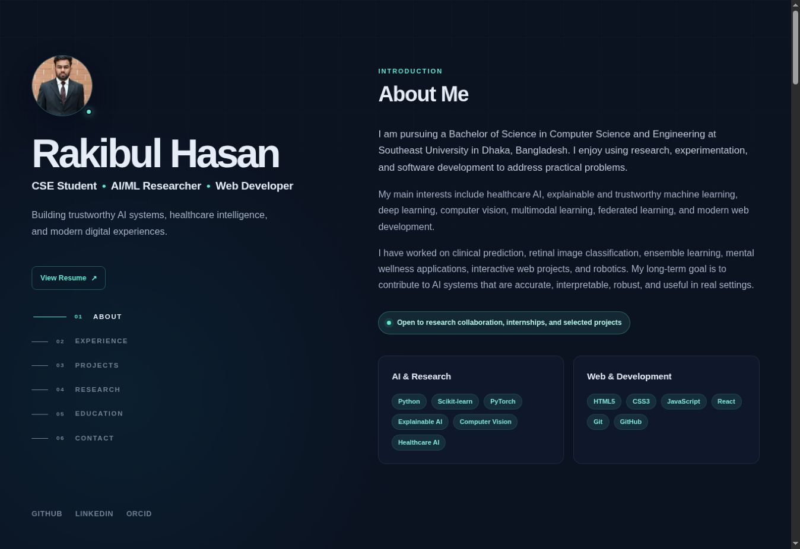

# Rakibul Hasan — Personal Portfolio

A responsive, accessible personal portfolio showcasing my academic background, AI/ML research, web development work, and selected projects. The interface uses a dark navy and teal visual system with a fixed desktop introduction panel and a focused, scrollable content area.

## Live Website

**[View the live portfolio](https://nexliorakibul.github.io/)**



## About the Project

This portfolio was created for my CSE web programming project and as a long-term professional profile. It presents my work in healthcare AI, explainable machine learning, computer vision, web development, and embedded systems.

The website is built entirely with HTML5, CSS3, and vanilla JavaScript. It does not require a framework, package manager, or build process.

## Features

- Responsive two-column desktop layout with mobile and tablet adaptations
- Professional profile photo and downloadable resume
- Semantic About, Experience, Projects, Research, Education, and Contact sections
- Interactive project filtering by Research, AI/ML, Web, and Embedded categories
- Automatic active-navigation state while scrolling
- Mobile navigation with keyboard and `Escape` key support
- Scroll-reveal animation with reduced-motion support
- Copy-to-clipboard email button with accessible status feedback
- Back-to-top control and dynamically generated copyright year
- Accessible labels, focus states, skip link, and semantic HTML structure

## Technologies

| Area | Technology |
| --- | --- |
| Structure | HTML5 |
| Styling | CSS3, Flexbox, CSS Grid, media queries |
| Interaction | Vanilla JavaScript, Intersection Observer, Clipboard API |
| Version control | Git and GitHub |
| Hosting | GitHub Pages |

## Project Structure

```text
nexliorakibul.github.io/
├── index.html
├── README.md
├── css/
│   └── style.css
├── js/
│   └── script.js
└── assets/
    ├── portfolio-preview.jpg
    ├── rakibul-hasan-profile.webp
    └── Rakibul_Hasan_Resume.pdf
```

## Run Locally

No installation is required.

### Option 1 — Open directly

Download or clone the repository, then open `index.html` in a browser.

### Option 2 — Run a local server

```bash
git clone https://github.com/nexliorakibul/nexliorakibul.github.io.git
cd nexliorakibul.github.io
python3 -m http.server 8000
```

Open `http://localhost:8000` in your browser.

## JavaScript Highlights

The project includes original JavaScript functionality for project filtering, active-section tracking, mobile navigation, clipboard interaction, scroll-based reveals, and the back-to-top button. The implementation also respects the user's reduced-motion preference.

## Deployment

The website is deployed from the `main` branch through GitHub Pages. Updates pushed to `main` are published automatically.

## Commit History

The repository uses focused commits to document the development process, including:

1. Project structure and semantic HTML
2. Responsive visual design
3. JavaScript interactions
4. Deployment asset versioning
5. Navigation refinement
6. Project visuals and verified details
7. Profile photo and resume integration
8. Profile-link correction and repository documentation

View the complete [commit history](https://github.com/nexliorakibul/nexliorakibul.github.io/commits/main/).

## Author

**Rakibul Hasan**

Computer Science and Engineering, Southeast University

Dhaka, Bangladesh

- [GitHub](https://github.com/nexliorakibul)
- [LinkedIn](https://www.linkedin.com/in/rakibul-aqib)
- [ORCID](https://orcid.org/0009-0002-3226-7722)

## License

This project is maintained as a personal academic portfolio. The source code may be used for learning and reference with appropriate attribution. Personal content, photographs, and resume information may not be reused without permission.
